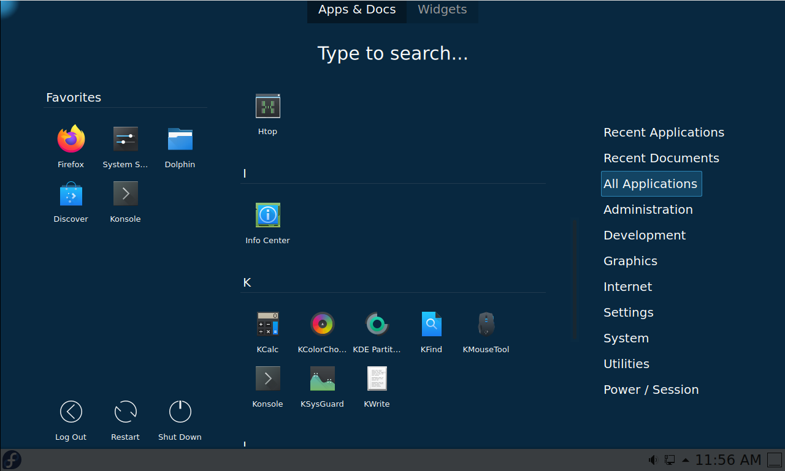
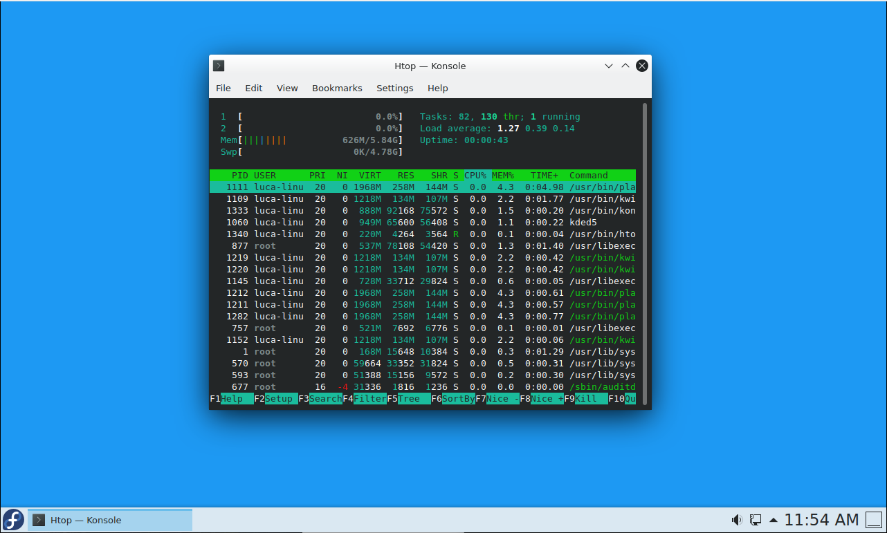
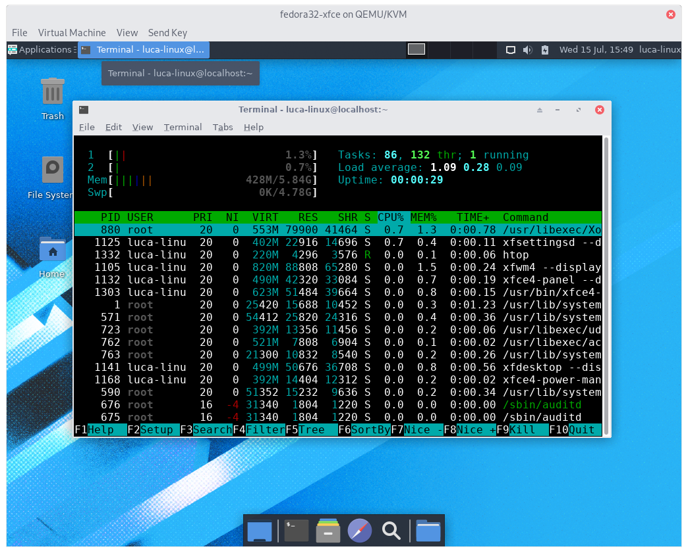

# Fedora Workstation Minimal

This ansible playbook aims to setup a minimal, yet fully featured, instance of Fedora Workstation
starting from a minimal netinstall.

Available DE are:

- GNOME
- KDE
- XFCE
- phosh (EXPERIMENTAL)

## Installing the base system

- Download Fedora Everything ISO [Everything ISO](https://fedora.mirror.garr.it/fedora/linux/releases/32/Everything/x86_64/iso/Fedora-Everything-netinst-x86_64-32-1.6.iso)
- Prepare Boot Media following [Install Instructions](http://docs.fedoraproject.org/en-US/Fedora/html/Installation_Guide/sect-preparing-boot-media.html)
- In the installer under Software Selection, select Minimal Install.
- Create your user and be sure to **mark user as administrator**

## Running the playbook

The best way to run it is from an external machine (the playbook will reboot the machine a couple of times).
Be sure you have **ssh access to the target machine**.

Run:

```sh
./install.sh machine_ip --all,gnome
```

this will launch the ansible playbook. Wait it to finish.

### Tags

Available tags are:

- system_tweaks will tweak the system for performance 
- base_distro   will install all basic packages
- powersave (optional)    will tweak the system for laptops and install all powersaving features  **This has to be explicitely specified to be run**
- kde (optional) **this has to be explicitely specified to be run**
- gnome (optional) **this has to be explicitely specified to be run**
- xfce (optional) **this has to be explicitely specified to be run**
- phosh (optional - EXPERIMENTAL) **This has to be explicitely specified to be run**

So to run all the tags (ie. on a laptop we want Powersaving Tweaks), we will run:

```sh
./install.sh MACHINE_IP --tags all,system_tweaks,powersave,GNOME
```

More atomic tags are available:

- base_packages
- codecs
- zip
- rpmfusion
- gnome
- kde
- phosh
- xfce

Those will only run the specific task ie. for installing only codecs and rpmfusion, etc.

---

# Result:






After install:

- `rpm -qa | wc -l` yelds **1248** packages for GNOME, **1375** for KDE, **1211** for XFCE
- process after boot:
    - 111 GNOME
    - 87 KDE
    - 83 XFCE
- about 600~650mb of ram occupied after boot (both GNOME and KDE), ~420mb for XFCE

To be noted:

With a minimal install both KDE and GNOME ram consumption is absolutely comparable, if measured with the same
tool ( `htop` )
If we measure with `gnome-system-monitor` it reports a higher RAM usage for GNOME and at the same time,
`ksysguard` reports much lower RAM usage for KDE, both compared to `htop`. 

So keep in mind that:

- `gnome-system-monitor` **over reports ram usage**
- `ksysguard` **under reports ram usage**

