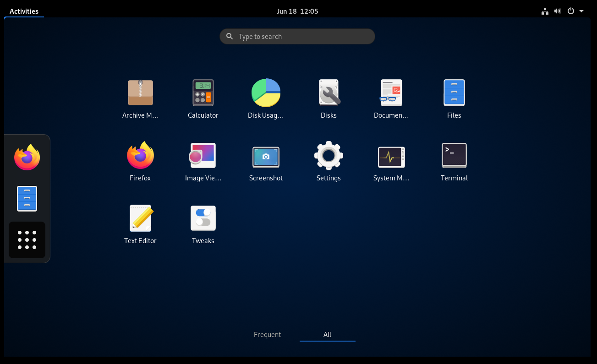
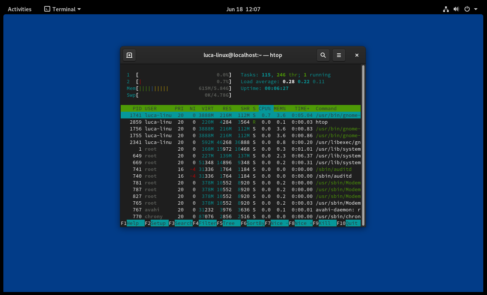

# Fedora Workstation Minimal

This ansible playbook aims to setup a minimal, yet fully featured, instance of Fedora Workstation
starting from a minimal netinstall.

## Installing the base system

- Download Fedora Server [Netinstall ISO](https://getfedora.org/en/server/download/)
- Prepare Boot Media following [Install Instructions](http://docs.fedoraproject.org/en-US/Fedora/html/Installation_Guide/sect-preparing-boot-media.html)
- In the installer under Software Selection, select Minimal Install.
- Create your user and be sure to **mark user as administrator**

## Running the playbook

The best way to run it is from an external machine (the playbook will reboot the machine a couple of times).
Be sure you have **ssh access to the target machine**.

Run:

```sh
./install.sh MACHINE_IP
```

this will launch the ansible playbook. Wait it to finish.

### Tags

Available tags are:

- base_distro
  - `base_distro`   will install all basic packages  
- system_tweaks (optional)
  - `system_tweaks` will tweak the system for performance  **This has to be explicitely specified to be run**
- powersave (optional)
  - `powersave`     will tweak the system for laptops and install all powersaving features  **This has to be explicitely specified to be run**

So to run all the tags (ie. on a laptop we want Powersaving Tweaks), we will run:

```sh
./install.sh MACHINE_IP --tags base_distro,system_tweaks,powersave
```

More atomic tags are available:

- base_packages
- codecs
- zip
- rpmfusion

Those will only run the specific task ie. for installing only codecs and rpmfusion, etc.

---

# Result:




After install:

- `rpm -qa | wc -l` yelds **1248** packages
- 220 process after boot
- about 600~650mb of ram occupied after boot
